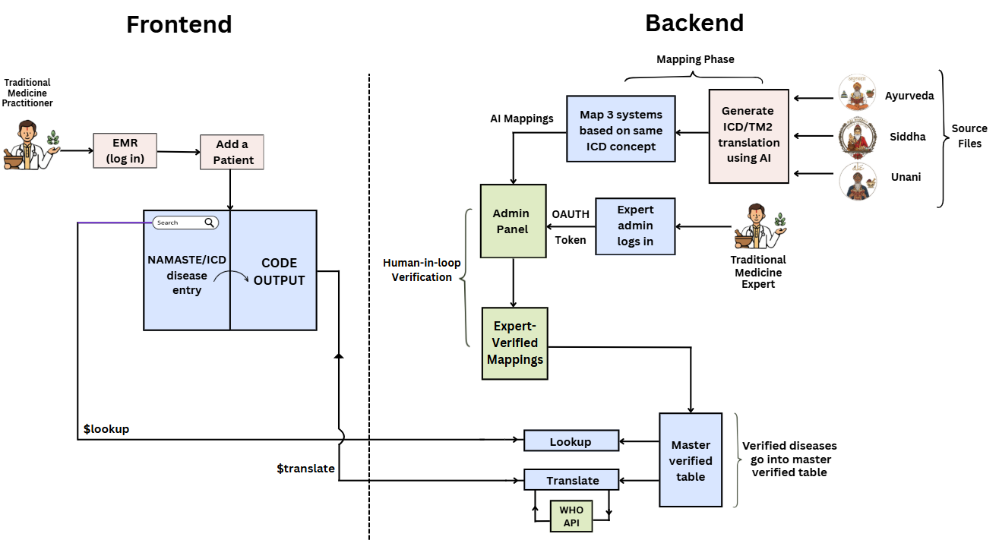

# 🌿AYUR-SYNC-API  SIH 2025 

A next-gen API-driven platform to **integrate NAMASTE codes, WHO ICD-11 TM2, and Biomedicine** into FHIR-compliant EMR systems.  
Our solution empowers clinicians to seamlessly combine **Ayush diagnoses (Ayurveda, Siddha, Unani)** with **ICD-11 coding** for **interoperability, insurance, and global reporting**.  
###(CHECK RELEASES TO SEE THE V1 OF AYUR SYNC API ADMIN PANEL)
 <!-- Replace with actual GIF -->


## Hackathon Feature Coverage Matrix (Added)

Implemented (Green):
- Dual coding storage (DiagnosisEvent captures NAMASTE + ICD + TM2 + release)
- FHIR endpoints: CodeSystem lookup/read, ValueSet $expand, ConceptMap $translate (forward & reverse), ConceptMap release export, Bundle ingest, Provenance (mapping + release bundle)
- Versioning: ConceptMapRelease + ConceptMapElement snapshots, release-scoped translation/lookups
- Provenance: per-mapping and release-wide bundle
- WHO Sync Scheduler: periodic enrichment + optional release creation
- External Semantics: placeholder SNOMED/LOINC linkage endpoint
- Security: ABHA token modes (mock / HMAC), JWT fallback
- Consent Framework: Feature-flagged enforcement for translation + bundle.ingest scopes
- Analytics: Morbidity top counts, dual-coding coverage
- TM2 Integration: On-demand WHO TM2 enrichment persisted in ICD11Code fields
- Caching: Translation cache keyed by release & direction

Partial / Future (Amber):
- Consent patient-specific scopes (global wildcard implemented; per-patient extension ready)
- Advanced provenance chain (MappingAudit basis present; future could add entity.agent granularity)

Deferred (Red / Future Roadmap):
- SNOMED & LOINC full ingestion
- ABHA production OAuth / JWK verification
- Formal FHIR Package publication & $validate-code


---

## 🏆 Smart India Hackathon 2025  

- **Organization:** Ministry of Ayush  
- **Department:** All India Institute of Ayurveda (AIIA)  
- **Category:** Software  
- **Theme:** MedTech / BioTech / HealthTech  

---

## 📌 Problem Statement  

**ID:** 25026  
**Title:** Develop API code to integrate NAMASTE and/or ICD-11 (TM2) into EMR systems that comply with India’s EHR Standards.  

### 🔎 Background  
India’s Ayush sector is rapidly shifting to **digital health records**. To standardize this transition, EMR systems must support:  
- **NAMASTE codes** – 4,500+ standardized AYUSH terms  
- **ICD-11 (TM2 & Biomedicine)** – 529 disorders + 196 pattern codes  
- **EHR Standards (2016)** – FHIR R4 APIs, SNOMED CT, LOINC, ISO 22600, ABHA OAuth 2.0, audit trails  

### ❗ Problem  
Existing EMR vendors lack lightweight, FHIR-compliant plugins to **map NAMASTE ↔ ICD-11** codes, support **dual coding**, and provide **secure interoperability**.  

---

## 💡 Our Solution – Ayur Sync  

We propose **Ayur Sync**, a **lightweight FHIR microservice** that:  

- ✅ Ingests **NAMASTE CSV** & generates FHIR `CodeSystem` + `ConceptMap`  
- ✅ Fetches updates from **WHO ICD-11 API (TM2 + Biomedicine)**  
- ✅ Provides **REST endpoints** for:  
  - Auto-complete lookups (NAMASTE + ICD-11)  
  - Translation operations (**NAMASTE ↔ TM2**)  
  - Encounter uploads with **dual coding** in FHIR Bundles  
- ✅ Implements **OAuth 2.0 with ABHA** for secure access  
- ✅ Tracks versions, consent, and audit metadata (per EHR Standards)  
- ✅ Simple **Web Interface (React + Next.js)** for clinicians to:  
  - Search NAMASTE/ICD-11 terms  
  - View mapped codes  
  - Construct FHIR ProblemList entries  

---

## 👨‍👩‍👦 Team  

- **Team Name:** 🚀 *AYUR NEXUS*  
- **Team Members:**  
  - Rohan Baiju
  - Dhiya K   
  - Srijan Srivasta
  - Joel Jo 
  - Ananya Y
  - Sruthi Subhash 

---

## 🛠 Tech Stack  

<p align="center">
  
  
  
  
  
  
  
  
  
  
</p>  

---

## 🖼 UI Screenshots  

<p align="center">
  
  
  
</p>  

---

## 📊 System Flow  

<p align="center">
  

</p>  

## WorkFlow

* **(Login To Admin Pannel):** 


* **(Mapping and Linking the disease  ):**


---

## 🗂 ConceptMap Versioning (Hackathon Snapshot)

We create an immutable snapshot of all VERIFIED mappings at startup (version `v1-submission`).

Endpoints:
- `GET /api/v1/admin/conceptmap/releases` – list releases
- `GET /api/v1/admin/conceptmap/releases/latest` – current active snapshot
- `GET /api/v1/admin/conceptmap/releases/{version}/elements?icd_name=...` – slice elements
- `GET /api/v1/admin/conceptmap/releases/{version}/diff?from=...` – diff stub (structure ready)

Verification writes an audit row (`mapping_audit`), enabling provenance expansion.

Response augmentation:
- Public `/translate` now returns: `release_version`, `direction`, enriched WHO MMS/TM2 context (when available).
- Reverse translation endpoint: `/translate/reverse?icd_name=...`.

---

## 🧬 FHIR Alignment (Current Surface)

| FHIR Artifact / Operation | Status | Notes |
|---------------------------|--------|-------|
| CapabilityStatement `/fhir/metadata` | Implemented | Lists CodeSystem, ValueSet, ConceptMap operations |
| CodeSystem read `/fhir/CodeSystem/{system}` | Implemented | not-present content mode |
| CodeSystem `$lookup` | Implemented | Returns Parameters / OperationOutcome on not-found |
| ValueSet `$expand` | Implemented | Basic filtering, count limit |
| ConceptMap `$translate` | Implemented | Primary NAMASTE → ICD (Parameters / OperationOutcome) |
| Reverse translate (public) | Implemented | `/public/translate/reverse` includes version |
| Bundle ingest | Prototype | `/fhir/Bundle` classification (valid/mismatch/unknown) |
| OperationOutcome standardization | Basic | Unified helper used for errors |

Roadmap (after submission): real diff engine, ConceptMap history, full patient-level consent, SNOMED/LOINC bridging.

---

## 📦 Bundle Ingest Prototype

POST `/fhir/Bundle` accepts a simplified Condition collection and returns:
```json
{
  "summary": {"resourceType": "OperationOutcome", "issue": [...]},
  "details": [
    {"status": "valid", "namaste_code": "AYU-123", "icd": "1A23.4"},
    {"status": "mismatch", "namaste_code": "AYU-987", "provided_icd": "ZZ99", "expected_icd": "1B45"}
  ]
}
```
Use this to demo dual-coding validation + future curation feedback loop.

---

## 🔍 Status & Observability

- `GET /api/v1/status` → { total_mappings, verified_mappings, verified_pct, current_release, release_elements, audit_events }
- `GET /api/v1/public/translate/cache/stats` → in-memory translation cache metrics.

Cache entry key pattern: `<release>|<direction>|<identifier>` with TTL 1h.

---

## 🔐 Security & Consent (Seed Stage)

Stub consent table + global active row (ready for per-patient in next phase). JWT includes future field for scopes (planned). OperationOutcome responses unify error semantics for FHIR-like endpoints.

---

## 🧪 Demo Script (Judge-Friendly)
1. Hit `/api/v1/status` – show snapshot + release.
2. Call `/api/v1/public/translate?icd_name=...` – see `release_version`.
3. Call `/api/v1/public/translate/reverse?icd_name=...` – reverse mapping with same version.
4. List releases `/api/v1/admin/conceptmap/releases` – show `v1-submission`.
5. Show diff stub `/api/v1/admin/conceptmap/releases/v1-submission/diff` – structural readiness.
6. Ingest sample Bundle – mismatch classification.
7. Show cache stats before/after multiple translate calls.
8. Display audit entries (verify a mapping via `/api/v1/admin/verify`).
9. For Local testing run:
   cd 'D:\AYUR-SYNC-API\BACKEND'; python -m http.server 5500 -- and then navigate to the address in a browser, then enter admin panel mpa, admin panel would directly open then.
10.Docker container will be automatically updated if any code changes are committed due to DEV_MODE=1, but still if reset is required then run nuke all script from BACKEND directory.

---

## 🗺 Roadmap (Post-Submission)
| Area | Next Step | Expansion |
|------|-----------|-----------|
| Versioning | Real diff + hash | Release history & rollback |
| FHIR | Bundle persistence | Observation linking & analytics |
| Security | Scoped tokens | ABHA OAuth2 + patient consent engine |
| TM2 | Full sync job | Deprecation impact alerts |
| Semantics | SNOMED/LOINC crosswalk | CDS and lab interoperability |
| Provenance | Hash chain audit | Signed releases & integrity verification |

---

## ⚡ Performance Notes
Initial translation responses cached (hit ratio metrics). TM2 + WHO calls (future) planned for local snapshot to reduce latency.

